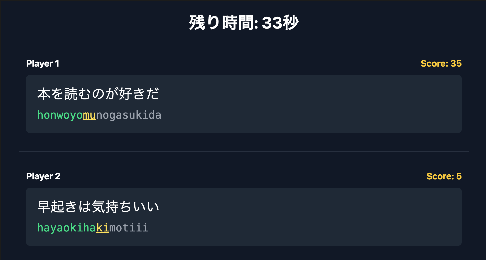

# VS TypingDojo

同じ PC 上で 2 人が同時に対戦できるタイピングゲームです。
2 つのキーボードを使い、片方だけ Caps Lock を ON にして遊びます。



**[▶ ブラウザですぐに遊ぶ](https://coderdojo-iwata.github.io/vs-typing-dojo-ts/)**

## 遊び方

1. **対戦開始** ボタンを押す
2. カウントダウン後にゲームスタート
3. 表示された日本語をローマ字で入力
4. 60 秒経過、またはどちらかが全文打ちきったら終了
5. スコアの高いプレイヤーの勝ち

### プレイヤー操作

| プレイヤー | 入力方法                      |
| ---------- | ----------------------------- |
| Player 1   | Caps Lock OFF（小文字）で入力 |
| Player 2   | Caps Lock ON（大文字）で入力  |

## 起動方法

### Dev Container を使う（推奨）

[Dev Containers 拡張機能](https://marketplace.visualstudio.com/items?itemName=ms-vscode-remote.remote-containers) をインストールした VS Code と [Docker](https://www.docker.com/) があれば、環境構築なしで開発を始められます。

1. VS Code でリポジトリを開く
2. コマンドパレット（`Ctrl+Shift+P` / `Cmd+Shift+P`）で **Dev Containers: Reopen in Container** を選択
3. コンテナのビルド完了後、ターミナルで以下を実行

```bash
npm run dev
```

ブラウザで http://localhost:5173 を開きます（ポートが自動フォワードされます）。

### ローカル環境で使う

[Node.js](https://nodejs.org/) v18 以上をインストールした上で以下のコマンドを実行します。

```bash
npm install
npm run dev
```

ブラウザで http://localhost:5173 を開きます。

## スクリプト

| コマンド             | 説明                       |
| -------------------- | -------------------------- |
| `npm run dev`        | 開発サーバー起動           |
| `npm run build`      | プロダクションビルド       |
| `npm run test`       | テスト実行                 |
| `npm run test:watch` | テスト（ウォッチモード）   |
| `npm run lint`       | ESLint チェック            |
| `npm run typecheck`  | TypeScript 型チェック      |
| `npm run check`      | 型チェック + Lint + テスト |

## 技術スタック

- React 18 + TypeScript
- Vite
- Vitest
- Tailwind CSS

## ライセンス

このプロジェクトは MIT ライセンスの下で公開されています。

このプロジェクトは [claude-code-book-chapter4](https://github.com/GenerativeAgents/claude-code-book-chapter4) のコードを基にしています。

MIT License - Copyright (c) 2026 Generative Agents

詳細は [元のライセンス](https://github.com/GenerativeAgents/claude-code-book-chapter4/blob/main/LICENSE) をご確認ください。
