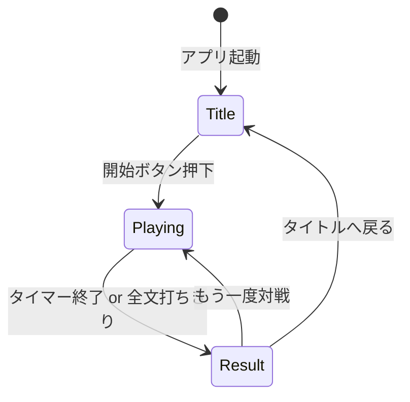
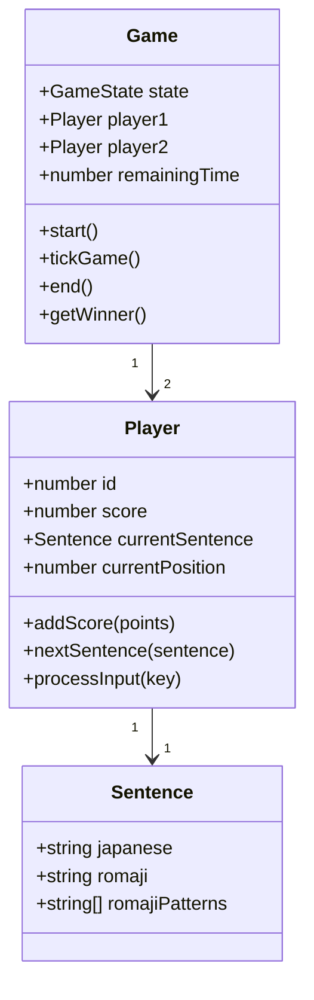
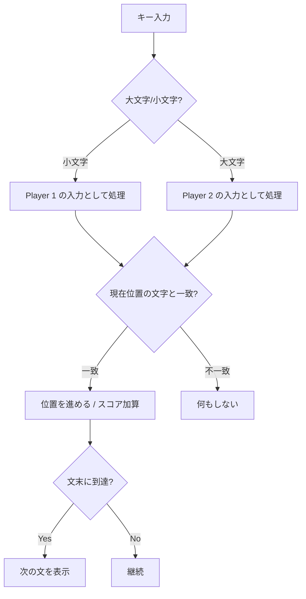
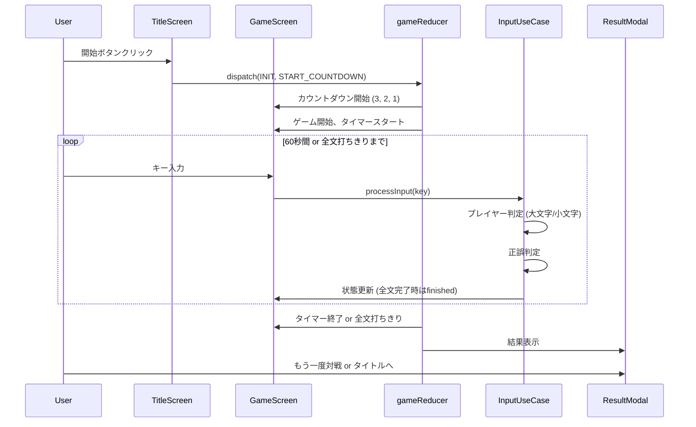

# 機能設計書

## システム構成図

```
┌─────────────────────────────────────────────────────────────┐
│  Browser                                                    │
│  ┌───────────────────────────────────────────────────────┐ │
│  │  React Application                                     │ │
│  │  ┌─────────────────────────────────────────────────┐  │ │
│  │  │  Presentation Layer                              │  │ │
│  │  │  - GameScreen (メイン画面)                       │  │ │
│  │  │  - PlayerArea (プレイヤー領域 x2)                │  │ │
│  │  │  - Timer / ScoreBoard / ResultModal             │  │ │
│  │  └─────────────────────────────────────────────────┘  │ │
│  │                         │                              │ │
│  │  ┌─────────────────────────────────────────────────┐  │ │
│  │  │  Application Layer                               │  │ │
│  │  │  - InputUseCase (入力処理)                       │  │ │
│  │  │  - gameReducer (ゲーム状態管理)                  │  │ │
│  │  └─────────────────────────────────────────────────┘  │ │
│  │                         │                              │ │
│  │  ┌─────────────────────────────────────────────────┐  │ │
│  │  │  Domain Layer                                    │  │ │
│  │  │  - Player / Game / Sentence / RomajiConverter   │  │ │
│  │  └─────────────────────────────────────────────────┘  │ │
│  │                         │                              │ │
│  │  ┌─────────────────────────────────────────────────┐  │ │
│  │  │  Infrastructure Layer                            │  │ │
│  │  │  - SentenceRepository (出題データ取得)           │  │ │
│  │  └─────────────────────────────────────────────────┘  │ │
│  └───────────────────────────────────────────────────────┘ │
└─────────────────────────────────────────────────────────────┘
```

## 画面遷移図



## 画面設計

### タイトル画面

```
┌─────────────────────────────────────────────────────┐
│                                                     │
│                                                     │
│               タイピング道場                         │
│                                                     │
│           [ 対戦開始 ]                              │
│                                                     │
│         操作説明:                                   │
│         Player 1: Caps Lock OFF で入力             │
│         Player 2: Caps Lock ON で入力              │
│                                                     │
└─────────────────────────────────────────────────────┘
```

### ゲーム画面

```
┌─────────────────────────────────────────────────────┐
│  残り時間: 25秒                                      │
├─────────────────────────────────────────────────────┤
│  Player 1                           Score: 120      │
│  ┌───────────────────────────────────────────────┐ │
│  │ 今日はいい天気です                             │ │
│  │ kyouha[ii]tennkidesu                          │ │
│  │ ^^^^^^^^                                      │ │
│  │ (入力済み部分をハイライト)                     │ │
│  └───────────────────────────────────────────────┘ │
├─────────────────────────────────────────────────────┤
│  Player 2                           Score: 95       │
│  ┌───────────────────────────────────────────────┐ │
│  │ プログラミングは楽しい                         │ │
│  │ puro[gu]raminnguhatanoshii                    │ │
│  │ ^^^^                                          │ │
│  └───────────────────────────────────────────────┘ │
└─────────────────────────────────────────────────────┘
```

### 結果画面（モーダル）

```
┌─────────────────────────────────────────────────────┐
│                                                     │
│                   結果発表                          │
│                                                     │
│              Player 1 の勝ち!                       │
│                                                     │
│         Player 1: 250 点                            │
│         Player 2: 180 点                            │
│                                                     │
│         [ もう一度対戦 ]  [ タイトルへ ]            │
│                                                     │
└─────────────────────────────────────────────────────┘
```

## データモデル

### エンティティ



### 型定義

```typescript
// ゲームの状態
type GameState = 'idle' | 'countdown' | 'playing' | 'finished';

// プレイヤー
interface Player {
  id: 1 | 2;
  score: number;
  currentSentence: Sentence;
  currentChunkIndex: number;   // 現在入力中のchunkのインデックス
  currentInput: string;        // 現在のchunkに対する入力中の文字列
}

// 出題文
interface Sentence {
  japanese: string;              // 日本語表示用（例: "今日はいい天気です"）
  reading: string;               // ひらがな読み（例: "きょうはいいてんきです"）
  romaji: string;                // 表示用ローマ字（例: "kyouhaiitenkidesu"）
  chunks: RomajiChunk[];         // 入力判定用（位置ごとのパターン）
}

// ローマ字チャンク（1文字または複合文字単位）
interface RomajiChunk {
  char: string;        // 元のひらがな（例: "きょ", "う", "ん"）
  inputPatterns: string[];  // 許容される入力パターン（例: ["kyo", "kilyo", "kixyo"]）
}

// 例1: 「新聞」（しんぶん） - 「ん」の扱い
// {
//   japanese: "新聞",
//   reading: "しんぶん",
//   romaji: "shinbun",
//   chunks: [
//     { char: "し", inputPatterns: ["si", "shi", "ci"] },
//     { char: "ん", inputPatterns: ["n", "nn"] },  // 次が子音なのでnでOK
//     { char: "ぶ", inputPatterns: ["bu"] },
//     { char: "ん", inputPatterns: ["n", "nn"] }   // 文末
//   ]
// }

// 例2: 「今日」（きょう） - 拗音「ょ」の扱い
// {
//   japanese: "今日",
//   reading: "きょう",
//   romaji: "kyou",
//   chunks: [
//     { char: "きょ", inputPatterns: ["kyo", "kilyo", "kixyo"] },  // 拗音は1チャンク
//     { char: "う", inputPatterns: ["u"] }
//   ]
// }

// 例3: 「学校」（がっこう） - 促音「っ」の扱い
// {
//   japanese: "学校",
//   reading: "がっこう",
//   romaji: "gakkou",
//   chunks: [
//     { char: "が", inputPatterns: ["ga"] },
//     { char: "っこ", inputPatterns: [
//       "kko", "cco",                           // 子音を重ねる
//       "ltuko", "ltsuko", "xtuko", "xtsuko"    // 促音を単独入力 + ko
//     ]},
//     { char: "う", inputPatterns: ["u"] }
//   ]
// }

// 例4: 「出発」（しゅっぱつ） - 拗音+促音の複合
// {
//   japanese: "出発",
//   reading: "しゅっぱつ",
//   romaji: "shuppatu",
//   chunks: [
//     { char: "しゅ", inputPatterns: ["syu", "shu", "sixyu", "shilyu", ...] },  // 拗音
//     { char: "っぱ", inputPatterns: [
//       "ppa",                                  // 子音を重ねる
//       "ltupa", "ltsupa", "xtupa", "xtsupa"    // 促音を単独入力 + pa
//     ]},
//     { char: "つ", inputPatterns: ["tu", "tsu"] }
//   ]
// }

// ゲーム全体
interface Game {
  state: GameState;
  player1: Player;
  player2: Player;
  remainingTime: number;    // 秒
}
```

### データの流れ

```
sentences.json                 RomajiConverter              Sentence
┌─────────────────┐           ┌─────────────────┐         ┌─────────────────┐
│ japanese        │           │                 │         │ japanese        │
│ reading (ひらがな)│ ────────► │ convert()       │ ──────► │ reading         │
└─────────────────┘           │ ・romaji生成    │         │ romaji (表示用) │
                              │ ・chunks生成    │         │ chunks[]        │
                              └─────────────────┘         │  └ char         │
                                                          │  └ inputPatterns[]   │
                                                          └─────────────────┘
```

## コンポーネント設計

### Presentation Layer

| コンポーネント | 責務 |
|--------------|------|
| `App` | ルートコンポーネント、画面切り替え |
| `TitleScreen` | タイトル画面、開始ボタン |
| `GameScreen` | ゲーム画面全体のレイアウト |
| `PlayerArea` | 各プレイヤーのタイピングエリア |
| `SentenceDisplay` | 出題文とローマ字の表示 |
| `Timer` | 残り時間表示 |
| `ScoreBoard` | スコア表示 |
| `ResultModal` | 結果表示モーダル |

### Application Layer

| ユースケース | 責務 |
|------------|------|
| `InputUseCase` | キー入力の振り分け・正誤判定 |
| `gameReducer` | ゲーム状態遷移の管理 |

### Domain Layer

| クラス/関数 | 責務 |
|-----------|------|
| `Game` | ゲーム状態の管理 |
| `Player` | プレイヤー状態・スコア管理 |
| `Sentence` | 出題文の管理 |
| `RomajiConverter` | 日本語→ローマ字変換、入力パターン生成 |
| `InputValidator` | 入力の正誤判定 |

### Infrastructure Layer

| クラス | 責務 |
|-------|------|
| `SentenceRepository` | 出題データの取得インターフェース |
| `LocalSentenceRepository` | ローカルJSONから出題データを取得 |
| `ApiSentenceRepository` | OpenAI APIから出題データを動的生成 |
| `openaiClient` | OpenAI Chat Completions APIとの通信 |

## ローマ字変換ロジック

### 許容する入力パターン例

| ひらがな | 許容パターン |
|---------|-------------|
| し | si, shi, ci |
| ち | ti, chi |
| つ | tu, tsu |
| ふ | hu, fu |
| じ | zi, ji |
| しゃ | sya, sha |
| っ | 次の子音を重ねる (tt, kk, etc.) |
| ん | n, nn (次が母音/y/nの場合はnn必須) |

### 入力判定フロー



## 出題データ形式

```json
{
  "sentences": [
    {
      "japanese": "今日はいい天気です",
      "reading": "きょうはいいてんきです"
    },
    {
      "japanese": "プログラミングは楽しい",
      "reading": "ぷろぐらみんぐはたのしい"
    }
  ]
}
```

- `japanese`: 画面に表示する日本語
- `reading`: ひらがな読み（ローマ字変換の元データ）
- `romaji` と `chunks` は `RomajiConverter` がアプリ起動時に動的生成

### 出題ソース

| ソース | 説明 |
|-------|------|
| ローカル | `sentences.json`（30文）からランダム出題 |
| ChatGPT API | OpenAI API で毎回異なる10文を動的生成 |

タイトル画面で出題ソースを選択する。ChatGPT API 使用時はユーザーが API キーを設定する必要がある。

### なぜ動的解析か

- 出題順は毎回ランダム（両プレイヤーで同じ順番）
- 課題文の追加が `japanese` と `reading` だけで済む
- データがシンプルで管理しやすい
- ローカル・API どちらのソースでも同じ形式で対応可能

## ゲームフロー


